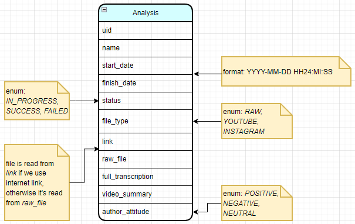

# Database design
The database management system used in this project is MongoDB.
## Diagram of the NoSQL database

## Example
```json
    {
        "uid":  1,
        "name":  "Indestructible shoes",
        "start_date":  "2023-04-21 13:45:00",
        "finish_date":  "2023-04-21 14:37:35",
        "status":  "SUCCESS",
        "file_type":  "YOUTUBE",
        "link":  "https://www.youtube.com/watch?v=4Tm0TCx6G4s&ab_channel=MarekAdBusterHoffmann",
        "raw_file":  "",
        "full_transcription":  "[...]",
        "video_summary": "Truly indestructible shoes",
        "author_attitude": "POSITIVE"
    }
```
Note that _raw_file_ is not used if _file_path_ key is present, and the other way around.
